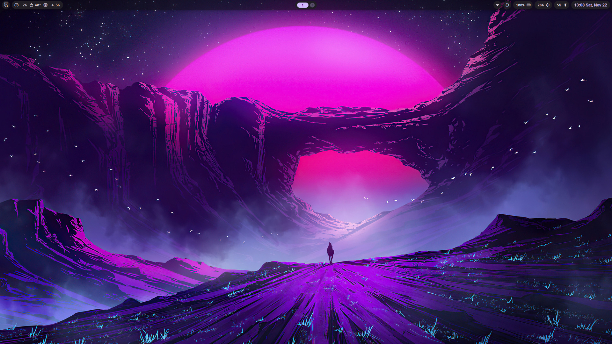

# Arch Linux setup
My Arch Linux setup for coding and university study.

### Window Manager
- [Niri](https://github.com/YaLTeR/niri)

### QuickShell
- [QuickShell](https://github.com/quickshell-mirror/quickshell)
- Config: [Noctalia-shell](https://github.com/noctalia-dev/noctalia-shell)

### Terminal
- [Alacritty](https://alacritty.org/)

### Text Editor
- [NeoVim](https://neovim.io/)

### Web Browser
- [Firefox](https://www.firefox.com/)
- Extension
  - UBlock Origin
  - Dark Reader
  - ClearURL

### Take Note
- [Obsidian](https://obsidian.md/)

### Audio Visualize
- [Cava](https://github.com/karlstav/cava)

# Showcase

